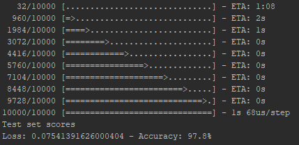

# Handwritten-Digits-Recognizer-Keras
Deep neural network for recognizing handwritten digits using Keras API.

## Layers
The neural network has an input layer, 2 hidden layers and an output layer. The input layer consists of 784 neuros and the same applies for first hidden layer. The second hidden layer consists of 100 neurons and the output has 10 neurons.

## Activation Functions
ReLU and softmax functions are used as activation functions. ReLU for the hidden layers and softmax for the ouput.

## Loss Function
The network uses categorical cross-entropy as loss function.

## Optimizer
The network uses Adam optimizer.

## Training/Test Data
The link for downloading the MNIST data that were used is provided below. It contains 60.000 training examples and 10.000 test examples.
http://yann.lecun.com/exdb/mnist/

## Model Training
The training set is fed to the network in 6 mini batches of 10.000 examples each and for 50 epochs.

## Sample of Evaluation

